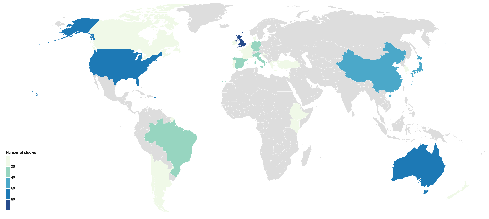

---
output:
  bookdown::pdf_document2: default
always_allow_html: true
toc: false
fontsize: 12pt
editor_options:
  chunk_output_type: inline
header-includes: \usepackage{float} \floatplacement{figure}{H} \floatplacement{table}{H}
---

```{r setup, include=FALSE}
# The grey text between '```' signifies 'code chunks' that should be run when the file is 'knitted'. The code is run in the background and will not be shown in the output document, but only the figures and text values will. Code that is run 'in-line' in the main text is indicated by '`r [code]`'. Figures and tables are cross-referenced using the 'bookdown' package and are indicated in the text by '\@ref(fig:chunk_name)', where 'chunk_name' is the name of the code chunk that runs the particular fig (figure) or tab (table). The codechunk is named using a single string following the '``` {r ' code (e.g. this code chunk is called 'setup'). This setup chunk sets the general otpions for the whole document so that the code is not shown (echo=FALSE). The first two code chunks are run together but are distinct, operationally.

knitr::opts_chunk$set(echo = FALSE) 
```
```{r global_environment_values, include=FALSE}
library(magrittr)

# The following code runs automatically when you 'knit' the file, and objects are saved to the global environment within this session. The original file is not affected and an output document (PDF) is produced and saved to the working directory.

# Load in the map database
data <- data<- read.csv('ghg_smap.csv')

# Generate a Google Scholar link based on the title
# Function to build GS link
buildGSlink <- function(title) {
  GSlink <- sub(" ", "", paste0("https://scholar.google.co.uk/scholar?start=0&q=", gsub(" ", "+", (gsub("[[:punct:]]", "", title))), "&hl=en&as_sdt=0,5"))
}
# Add link as a new column
data$url <- buildGSlink(data$title)
# Write the database including the GS link to a new file for external use
write.csv(data, 'mapdatabase.csv', row.names = FALSE)


# Create unique article-level data for plots about articles - do this if you have multiple studies per article or vice versa
# This creates a new dataframe (articledat) where each row is an ARTICLE (i.e. a published paper). The data included refer to the article (e.g. publication year, rather than the research studies they describe). You will use this dataframe for plots about publications/articles. The code identifies all unique values in the column 'citation_full' (you could use the title) and removes subsequent duplicates.
articledat <- data %>%
  dplyr::distinct(citation_full, .keep_all = TRUE)


# The following 'objects' describe the articles and are used within the text
num_art <- nrow(articledat) # The total number of articles (lines in the unique articles dataframe)
num_stud <- nrow(data) # The total number of studies (lines in the full database)
pub_typePC <- data.frame('Type' = rownames(as.data.frame((summary(as.factor(articledat$pub_type))))),
                         'Articles' = (as.data.frame((summary(as.factor(articledat$pub_type)))))[,1]) # A table of the number of articles of each type
type_art <- expss::vlookup('Article', pub_typePC, 'Articles') # Looks up the number of articles that are 'articles'
type_thes <- expss::vlookup('Thesis', pub_typePC, 'Articles') # Looks up the number of articles that are 'theses'
type_conf <- expss::vlookup('Conference Proceeding', pub_typePC, 'Articles') # Looks up the number of articles that are 'conference proceedings'
type_rep <- expss::vlookup('Report', pub_typePC, 'Articles')  # Looks up the number of articles that are 'reports'


# This code summarises the full database by country to show the number of studies in each nation
data$country <- gsub('USA', 'United States of America', data$country) # This example code shows how to change country spellings, like 'USA', to something else, like 'United States of America', in the database country column
country_summary <- data %>% 
  dplyr::count(country, sort = TRUE) # This code counts the number of lines in the full database of studies for each level of the variable country, and produces an alphabetically sorted dataframe
country_summary <- country_summary[order(-country_summary$n),] # This code orders the country dataframe by the number of studies for each country in descending order (descending is indicated by the '-').
above10pccountries <- subset(country_summary, n > (sum(n)/10)) # This code selects a subset of the list of countries and number of studies to those in the top 10% of all studies.
above10pccountries <- paste0(above10pccountries[,1], ' (', above10pccountries[,2], ')') # This code combines the table (country : number of studies) into a vector of strings for easy reference in the text (rather than a table): "country 1 (n1)" "country2 (n2)" etc.


# This code summarises the full database by soil texture classification
data$soil_text_class <- trimws(data$soil_text_class) # This code gives an example of tidying that you can do here, for example trimming whitespace (e.g. trailing spaces) from data in a column
data$FAO_soil_class <- gsub('NR', 'Not reported', data$FAO_soil_class) # This code shows that you can also convert acronyms or shortened text from the database into easily readable text, for example, replacing 'NR' with 'Not reported' for a given column.
data$soil_text_class[!nzchar(data$soil_text_class)] <- "Not reported" # This text replaces blank cells in a column with 'Not reported'
data$soilorder <- factor(data$soil_text_class, levels=c("Clay", "Clay loam", "Loam", "Loamy sand", "Sand", "Sandy clay",  "Sandy clay loam", "Sandy loam", "Silt", "Silt loam", "Silty clay", "Silty clay loam", "Unclear", "Not reported")) # This code specifies an order for a categorical variable - particularly useful when 'Unclear' or 'Not reported' should be separated from the default alphabetical ordering in plots
soil_summary <- data %>% 
  dplyr::count(soil_text_class, sort = TRUE) # This code counts the number of studies in each level of the soil texture variable and saves the output as a dataframe
soilnr <- expss::vlookup('NR', soil_summary, 'n') # This code looks up the number of studies with 'Not reported' in this summary dataframe
soilnrdat <- subset(data, soil_text_class == 'NR') # This code saves the studies with 'Not reported' soil texture classification as a new dataframe
soilnr_summary <- soilnrdat %>% 
  dplyr::count(USDA_soil_class, FAO_soil_class, sort = TRUE) %>%
  dplyr::rename('USDA soil classification' = USDA_soil_class, 'FAO soil classification' = FAO_soil_class) # This code then takes that dataframe and counts the number of studies with other types of soil classification data in two other columns


# This code takes a column with multiple labels in single cells separated by commas, and separates these into single lines in a new dataframe, in this case the column 'outcome'
alloutcomesdata <- data %>%
  tidyr::separate_rows(.,
                       outcome,
                       sep = ', ') # Separate outcome data that is separated by a comma and a space onto different lines
summdat <- alloutcomesdata %>% 
  dplyr::count(., 
               country, 
               outcome) # Produce a new dataframe counting the number of studies across the different levels of the variables country and outcome
summdat$country <- factor(summdat$country, levels=c("Kenya", "China", "Japan", "South Korea", "Belgium", "Croatia", "France", "Germany", "Greece", "Ireland", "Italy", "Netherlands", "Portugal", "Spain", "Turkey", "United Kingdom", "Israel", "Canada", "USA", "Australia", "New Zealand", "Argentina", "Brazil", "Chile")) # This code specifies an order for the country data

#The following text is what will appear in the document when it is 'knitted'. General R Markdown rules for layout apply. The {-} for subheadings indicates that the subheading should be ignored by the Table of Contents. The YAML text (the first bits of text at the top of the document) also set more options for the document, including that the Table of Contents should be omitted ('toc: false'). 
```

# Results {-}
## The systematic mapping process {-}
Details of the number of records retained through each stage of the review process are provided in Figure \@ref(fig:flowchart). A total of 38,325 potentially relevant records were identified across all of the resources searched. A total of 25,683 unique records was screened for eligibility, with 347 eligible records following full text screening. The final systematic map database contains `r num_stud` studies from `r num_art` articles.

```{r flowchart, fig.cap="ROSES flow chart for the systematic map, showing the number of records retained at each stage of the review process. Produced using the R package 'ROSES_flowchart' (Haddaway 2020).", echo=FALSE}
source('ROSES_flowchart.R') # This allows you to use functions saved in external .R files in the working directory - in this case a function to produce a ROSES-style flow diagram. 
flowchart <- ROSES_flowchart(dbresults = '38,325',
                otherresults = '500',
                deduped = '25,683',
                dupesremoved = '13,187',
                tandaincl = '1,813',
                tandaexcl = '23,825',
                titleincl = '',
                titleexcl = '',
                abstractincl = '',
                abstractexcl = '',
                ftretr = '1,772',
                ftnotretr <- data.frame(reason = c('Not accessible'), n = c('41')),
                ftincl = '347',
                ftexcl <- data.frame(reason = c('Relevant review', 'Population', 'Intervention', 'Comparator', 'Outcome', 'Study design', 'Duplicate', 'Language'), n = c('48', '825', '49', '68', '69', '188', '35', '127')),
                prescreened = '2',
                studart <- c('349', '536'),
                finalmapincl = '536',
                type = 'map')
rsvg::rsvg_pdf(svg = charToRaw(DiagrammeRsvg::export_svg(flowchart)),
                   file = 'figures/figure1.pdf') # This code runs the flow diagram function, saves it to an object, and then saves the resulting figure to a folder called 'figures' (you need to make sure the folder exists) as a PDF (helpful for some journals).
flowchart # This code then calls the object so that it is printed in the document.
```

## The systematic map database and visualisations {-}
### Descriptive information {-}

**Publication year:** As expected, there has been a significant increase in the number of published articles on the topic over the last 20 years (Figure \@ref(fig:yearplot)). Interestingly, there may be evidence of a reduction in publication rate over the most recent 5 years from 2014 to 2018. The earliest record in our database is from 1981. Since searches were performed in 2019, representation from this year is incomplete.

```{r yearplot, echo=FALSE, warning=FALSE, message=FALSE, fig.cap="Plot showing the final number of articles included in the systematic map by publication year.", results = "hide", fig.keep = 'all'} 
# The settings above ensure the code is not printed, warnings and messages are suppressed, a figure caption is included, and the R console output is hidden.
yearplot <- ggplot2::ggplot(data = articledat, 
                           ggplot2::aes(x = as.numeric(year))) +
  ggplot2::geom_bar(stat = "bin", 
                    binwidth = 1, 
                    color = 'White', 
                    fill = '#8CB3B0') + 
  ggplot2::theme_minimal() + 
  ggplot2::labs(
    x = "Publication year", 
    y = "Number of studies")
pdf(file = 'figures/figure 2.pdf', width = (dev.size())[1], height = (dev.size())[2]) # This code and the following lines (to 'dev.off()') saves the figure as a PDF in the 'figures' folder.
  yearplot
dev.off()
yearplot
```


**Publication type:** Some `r round((type_art/num_art)*100, digits = 0)`% of articles in the map database are traditional research papers, with only `r type_thes` theses, `r type_conf` conference papers, and `r type_rep` report. This may in some degree reflect the ease with which traditional research articles can be discovered, but may also be the result of the complex and expensive GHG measurement equipment needed for this type of research: it may be unlikely that unpublished reports would be conducted on a local or organisation scale.
\newline 
\newline 
**Country:** The choropleth in Figure \@ref(fig:choroplot) displays the number of studies per country in the map. Some `r length(above10pccountries)` countries each represented more than 10% of the total studies in the evidence base: `r paste0(paste(above10pccountries[1:length(above10pccountries)-1], collapse = ', '), ', and ', above10pccountries[length(above10pccountries)])`. Much of the evidence came from Europe (a total of 227 studies).


```{r choroplot, echo=FALSE, out.width='100%', warning=FALSE, message=FALSE, fig.cap="Choropleth showing the number of studies per country in the systematic map database."}
# This code chunk includes a pregenerated figure that is saved in the working directory along with a caption so taht it can be cross referenced in the text.

```


**Soil texture:** The most frequently reported soil texture information was from the [USDA Natural resources conservation service soil texture classification system](https://www.nrcs.usda.gov/wps/portal/nrcs/main/soils/survey/class/). Figure \@ref(fig:soiltextplot) shows the distribution of soil texture classifications across the evidence base. A large number of studies (`r soilnr` of `r num_stud`) did not report the soil texture classification. 

``` {r soiltextplot, warning=FALSE, message=FALSE, echo=FALSE, fig.cap="Soil texture classifications of studies in the systematic map", results = "hide", fig.keep = 'all'}
soiltextplot <- ggplot2::ggplot(data = data, 
                           ggplot2::aes(x = soilorder)) +
  ggplot2::geom_bar(stat = "count",
                    color = 'White', 
                    fill = '#8CB3B0') + 
  ggplot2::theme_minimal() +
  ggplot2::scale_x_discrete(limits = rev(levels(data$soilorder))) +
  ggplot2::stat_count(geom = "text", colour = "#8CB3B0", size = 3.5,
                      ggplot2::aes(label = ..count..), 
                      position = ggplot2::position_nudge(y = 3)) +
  ggplot2::coord_flip() + 
  ggplot2::labs(
    x = "Soil texture classification", 
    y = "Number of studies")
pdf(file = 'figures/figure 4.pdf', width = (dev.size())[1], height = (dev.size())[2])
  soiltextplot
dev.off()
soiltextplot
```


